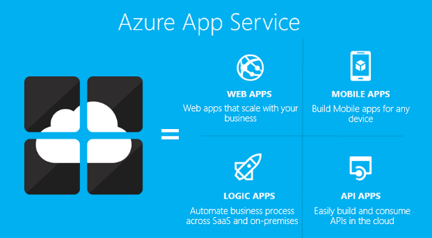

<properties 
	pageTitle="API Apps overview" 
	description="Learn why Azure App Service is the best platform for developing, publishing, and hosting RESTful APIs." 
	services="app-service\api" 
	documentationCenter=".net" 
	authors="tdykstra" 
	manager="wpickett" 
	editor="jimbe"/>

<tags 
	ms.service="app-service-api" 
	ms.workload="web" 
	ms.tgt_pltfrm="na" 
	ms.devlang="na" 
	ms.topic="article" 
	ms.date="10/15/2015" 
	ms.author="tdykstra"/>

# API Apps overview

API Apps is one of four app types offered by [Azure App Service](../app-service/app-service-value-prop-what-is.md).

API Apps provides a rich platform for building, hosting, and consuming APIs in the cloud and on-premises. Deploy your API as an API app in App Service and benefit from enterprise grade security, simple access control, hybrid connectivity, automatic SDK generation, and seamless integration with [Logic Apps](../app-service-logic/app-service-logic-what-are-logic-apps.md).

## Why API Apps?

API Apps provides the following features available today in public preview:

- **Easy consumption** - Integrated [Swagger](#concepts) support makes your APIs easily consumable by a variety of clients.  Easily configure [CORS](#concepts), and automatically generate client code for your APIs in a variety of languages including C#, Java, and Javascript.

- **Simple access control** - You can protect an API app from unauthenticated access with no changes to your code. Built-in authentication services secure APIs for access by by other services or by clients representing users. Supported identity providers include Azure Active Directory and third-party providers such as Facebook and Twitter. Clients can use Active Directory Authentication Library (ADAL) or the Mobile Apps SDK. For more information, see [Authentication for API apps and mobile apps in Azure App Service](../app-service/app-service-authentication-overview.md).

- **Visual Studio integration** - Dedicated tools in Visual Studio streamline the work of creating, deploying, consuming, debugging, and managing API apps.

- **Integration with Logic Apps** - API apps that you create can be consumed by [App Service Logic Apps](../app-service-logic/app-service-logic-what-are-logic-apps.md).    

- **Bring your existing API as-is** - You don't have to change any of the code in your existing APIs to take advantage of API Apps features -- just deploy your code to an API app. Your API can use any language or framework supported by App Service, including ASP.NET and C#, Java, PHP, Node.js and Python.

These are just a few highlights. For more features that API Apps can take advantage of, see the [Web Apps overview](../app-service-web/app-service-web-overview.md).

>[AZURE.NOTE] You can use [Azure API Management](../api-management/api-management-key-concepts.md) to control client access to APIs that are hosted by App Service API Apps. While API Apps provides authentication services, there are other access management features it does not offer which API Management does offer, such as endpoint consolidation and throttling.
>
>API Apps is currently in public preview. [App Service Web Apps](../app-service-web/app-service-web-overview.md) is a Generally Available (GA) service designed for building and hosting secure mission-critical applications at global scale. If you are looking for a GA service for building your API today, Web Apps is a great option. When API Apps goes GA, we'll provide a path for taking existing web apps and leveraging the additional features of API Apps.

## API Apps concepts ##

- **Swagger** - A framework for documentation and discovery of a RESTful API, used by default in API apps. For more information, see [http://swagger.io/](http://swagger.io/).
- **Cross Origin Resource Sharing (CORS)** - A mechanism that allows JavaScript running in a browser to make calls to an API hosted on a different domain than the web page was loaded from.
- **Trigger** - A REST API that [logic apps](../app-service-logic/app-service-logic-what-are-logic-apps.md) can call to initiate a workflow process when a certain condition is met. For example, an API app could provide a method that the logic app calls periodically to look for a certain phrase in a Twitter feed. For more information, see [API app triggers](app-service-api-dotnet-triggers.md).
- **Action** - A REST API that [logic apps](../app-service-logic/app-service-logic-what-are-logic-apps.md) can call to process data after a workflow has been started by a trigger. For example, an API app could provide a method that the logic app calls to respond to a tweet found by the Twitter trigger. Actions are API methods that are exposed by a Swagger API definition.
- **Gateway** - A web app that handles API administration functions and authentication for all API apps in a resource group.

## Getting started

To get started with API apps, follow the [Create an API app tutorial](app-service-dotnet-create-api-app.md).

To see a list of known issues with API Apps, see [the API Apps known issues forum post](https://social.msdn.microsoft.com/Forums/en-US/7f8b42f2-ac0d-48b8-a35e-3b4934e1c25e/api-app-known-issues?forum=AzureAPIApps).

For more information about the Azure App Service platform, see [Azure App Service](../app-service/app-service-value-prop-what-is.md).

 
