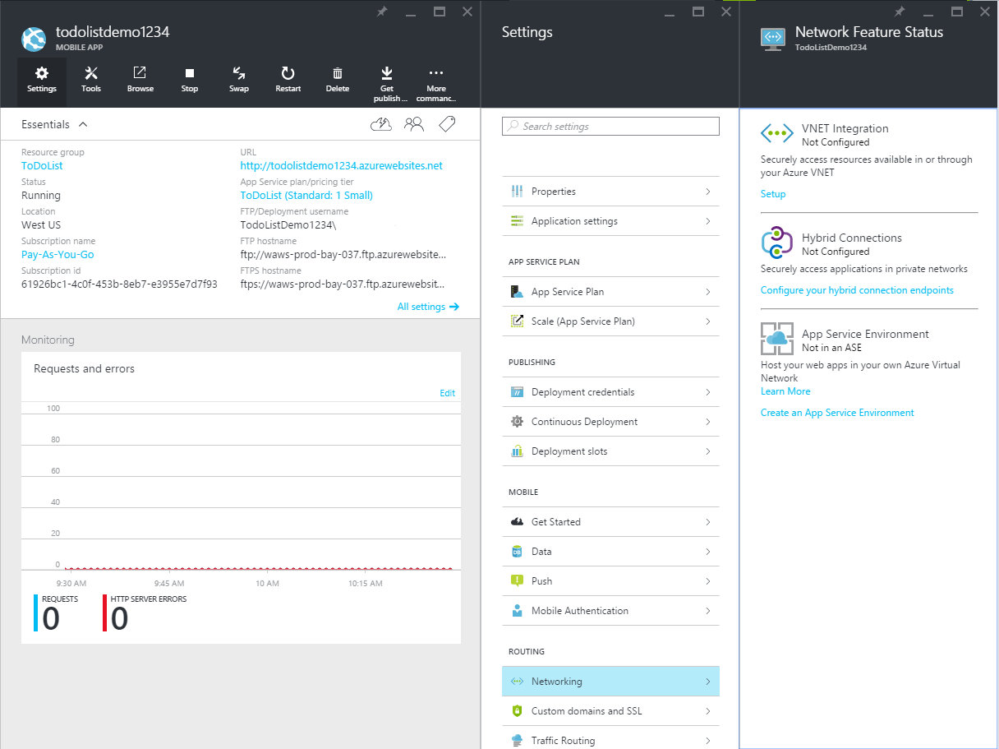
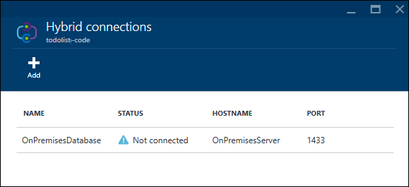

<properties
	pageTitle="Connect your Azure Mobile App to an on-premises SQL Server using Hybrid Connections | Microsoft Azure"
	description="Learn how to connect to an on-premises SQL Server from a App Service Mobile App using Hybrid Connections"
	services="app-service\mobile"
	documentationCenter=""
	authors="ggailey777"
	manager="dwrede"
	editor=""/>

<tags
	ms.service="app-service-mobile"
	ms.workload="na"
	ms.tgt_pltfrm="na"
	ms.devlang="multiple"
	ms.topic="get-started-article"
	ms.date="10/23/2015"
	ms.author="glenga"/>

# Connect to an on-premises SQL Server from Mobile Apps using Hybrid Connections

When your enterprise transitions to the cloud, you might not be able to migrate all of your assets to Azure right away. Hybrid Connections lets the Mobile Apps feature in Azure App Service securely connect to your on-premises assets. In this way, you can make your on-premises data accessible to your mobile clients by using Azure. Supported assets include any resource that runs on a static TCP port, including Microsoft SQL Server, MySQL, HTTP Web APIs, and most custom web services. Hybrid Connections use Shared Access Signature (SAS) authorization to secure the connections from your mobile service and the on-premises Hybrid Connection Manager to the hybrid connection. For more information, see [Hybrid Connections Overview](../integration-hybrid-connection-overview.md).

In this tutorial, you'll learn how to modify a Mobile App .NET backend to use a local on-premises SQL Server database instead of the default Azure SQL Database provisioned with your service.

[AZURE.INCLUDE [app-service-mobile-to-web-and-api](../../includes/app-service-mobile-to-web-and-api.md)] 

## Prerequisites ##

This tutorial requires you to have the following:

- **An existing Mobile App backend**  Follow the [quickstart tutorial](app-service-mobile-windows-store-dotnet-get-started.md) to create and download a new .NET backend Mobile App from the [Azure Portal].

[AZURE.INCLUDE [hybrid-connections-prerequisites](../../includes/hybrid-connections-prerequisites.md)]

## Install SQL Server Express, enable TCP/IP, and create a SQL Server database on-premises

[AZURE.INCLUDE [hybrid-connections-create-on-premises-database](../../includes/hybrid-connections-create-on-premises-database.md)]

## Create a Hybrid Connection

You need to create a new Hybrid Connection and BizTalk service for the code portion of your Mobile App backend, which is a web app.

1. In the [Azure Portal], browse to your Mobile App and click **Networking** in settings.

	

	

2. Click **Configure your hybrid connection endpoints** in the **Hybrid connections** section.

	

2. On the Hybrid connections blade, click **Add** then **New hybrid connection**.

3. On the **Create hybrid connection blade**, provide a **Name** and **Host Name** for your hybrid connection and set **Port** to `1433`.

	

4. Click **Biz Talk Service** and enter a name for the BizTalk service and click **OK** twice.

	This tutorial uses **mobile1**. you'll need to supply a unique name for your new BizTalk Service.

	After the process completes, the **Notifications** area flashes a green **SUCCESS** and the **Hybrid connection** blade shows the new hybrid connection with the status as **Not connected**.

	

At this point, you've completed an important part of the cloud hybrid connection infrastructure. Next, you'll create a corresponding on-premises piece.

## Install the on-premises Hybrid Connection Manager to complete the connection

[AZURE.INCLUDE [app-service-hybrid-connections-manager-install](../../includes/app-service-hybrid-connections-manager-install.md)]

## Configure the Mobile App backend project to connect to the SQL Server database

In this step, you define a connection string for the on-premises database and modify the Mobile App backend to use this connection.

1. In Visual Studio 2013, open the project that defines your Mobile App backend.

	To learn how to download your .NET backend project, see [quickstart tutorial](app-service-mobile-windows-store-dotnet-get-started.md).

2. In Solution Explorer, open the Web.config file, locate the **connectionStrings** section, add a new SqlClient entry like the following, which points to the on-premises SQL Server database:

	    <add name="OnPremisesDBConnection"
         connectionString="Data Source=OnPremisesServer,1433;
         Initial Catalog=OnPremisesDB;
         User ID=HybridConnectionLogin;
         Password=<**secure_password**>;
         MultipleActiveResultSets=True"
         providerName="System.Data.SqlClient" />

	Remember to replace `<**secure_password**>` in this string with the password you created for  *HybridConnectionLogin*.

3. Click **Save** in Visual Studio to save the Web.config file.

	> [AZURE.NOTE]This connection setting is used when running on the local computer. When running in Azure, this setting is overriden by the connection setting defined in the portal.

4. Expand the **Models** folder and open the data model file, which ends in *Context.cs*.

6. Modify the **DbContext** instance constructor to pass the value `OnPremisesDBConnection` to the base **DbContext** constructor, similar to the following snippet:

        public class hybridService1Context : DbContext
        {
            public hybridService1Context()
                : base("OnPremisesDBConnection")
            {
            }
        }

	The service will now use the new connection to the SQL Server database.

## Update Azure to use the on-premises connection string

Next, you need to add an app setting for this new connection string so that it can be used from Azure.  

1. Back in the [Azure Portal] in the web app backend code for your Mobile App, click **All settings**, then **Application settings**.

3. In the **Web app settings** blade, scroll down to **Connection strings** and add an new **SQL Server** connection string named `OnPremisesDBConnection` with a value like `Server=OnPremisesServer,1433;Database=OnPremisesDB;User ID=HybridConnectionsLogin;Password=<**secure_password**>`.

	Replace `<**secure_password**>` with the secure password for your on-premises database.

	

2. Press **Save** to save the hybrid connection and connection string you just created.

## Publish and test the Mobile App backend in Azure

Finally, you need to publish the Mobile App backend to Azure and verify that it is using the hybrid connection to store data in the on-premises database.

3. In Visual Studio, right-click the project, click **Publish**, then in **Publish Web** click **Microsoft Azure Websites**.

	Instead of using Visual Studio, you can also [use Git to publish your backend](mobile-services-dotnet-backend-store-code-source-control.md).

2. Sign in with your Azure credentials and select your service from **Select Existing Websites**.

	Visual Studio downloads your publish settings directly from Azure.

3. Finally, click **Publish**.

	After publishing completes, the service restarts and the backend start page is displayed.

4. Using a client app connected to your Mobile App, invoke some operations that generate database changes.

5. In SQL Server Management Studio, connect to your SQL Server instance, open the Object Explorer, expand the **OnPremisesDB** database and expand **Tables**.

6. Right-click the **hybridService1.TodoItems** table and choose **Select Top 1000 Rows** to view the results.

	Note that changes generated in your client app are saved by your Mobile App backend to your on-premises database using the hybrid connection.

## See Also ##

+ [Hybrid Connections web site](../../services/biztalk-services/)
+ [Hybrid Connections overview](../integration-hybrid-connection-overview.md)
+ [BizTalk Services: Dashboard, Monitor, Scale, Configure, and Hybrid Connection tabs](../biztalk-dashboard-monitor-scale-tabs.md)
+ [How to make data model changes to a .NET backend mobile service](../mobile-services-dotnet-backend-how-to-use-code-first-migrations.md)

<!-- IMAGES -->

<!-- Links -->
[Azure Portal]: https://portal.azure.com/
[Azure Management Portal]: http://go.microsoft.com/fwlink/p/?linkid=213885
[Get started with Mobile Services]: ../mobile-services-windows-store-dotnet-get-started.md
