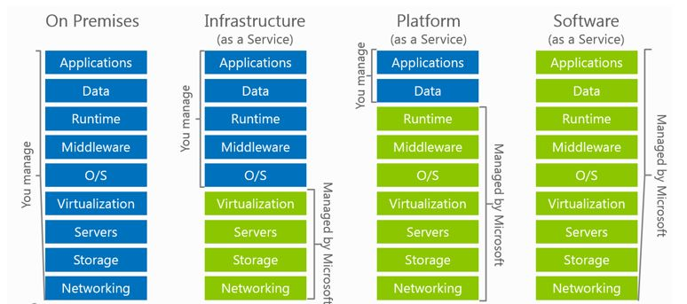
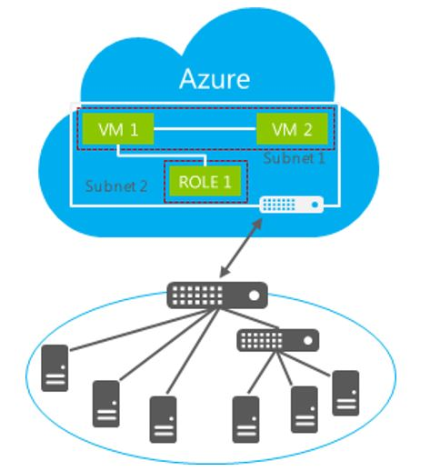

<properties
   pageTitle="Best Practices for Software Updates on Microsoft Azure IaaS | Microsoft Azure"
   description="Article provides a collection of best practices for software updates in an Microsoft Azure IaaS environment.  It is intended for IT professionals and security analysts who deal with change control, software update and asset management on a daily basis, including those responsible for their organization's security and compliance efforts."
   services="virtual-machines, cloud-services, storage"
   documentationCenter="na"
   authors="YuriD"
   manager="swadhwa"
   editor=""
   tags="azure-service-management,azure-resource-manager"/>

<tags
   ms.service="azure-security"
   ms.devlang="na"
   ms.topic="article"
   ms.tgt_pltfrm="na"
   ms.workload="na"
   ms.date="09/03/2015"
   ms.author="yurid"/>

#Best practices for software updates on Microsoft Azure IaaS

Before diving into any kind of discussion on best practices for an Azure IaaS environment, it is important to understand what the scenarios are that will have you managing software updates. The diagram below should help with this:

In the traditional datacenter model where the entire infrastructure is located on-premises, you have full responsibility for managing updates to operating systems, applications, network devices (routers, switches, etc.) and hardware (firmware). In an IaaS scenario, you will still have to manage updates for operating systems and applications; however, the entire infrastructure underneath the operating systems and applications is managed by Microsoft. In all these models, customers are still owners of their data and are still responsible for protecting it at the end point level.

In a PaaS scenario, you will have even less responsibility for software updates, as update management for the operating system is Microsoft’s responsibility. In a SaaS scenario, the responsibility for software updates for the entire stack is owned by Microsoft.

These same principles apply in a hybrid scenario where your company is using Azure IaaS VMs that communicate with on-premises resources as shown in the diagram below.

## Initial assessment

Even if your company is already using an update management system and you already have software update policies in place, it is important to frequently revisit previous policy assessments and update them based on your current requirements. This means that you need to be familiar with the current state of the resources in your company. To reach this state, you have to know:

-   The physical and virtual computers in your enterprise.

-   Operating systems and versions running on each of these physical and virtual computers.

-   Software updates currently installed on each computer (service pack versions, software updates, and other modifications).

-   The function each computer performs in your enterprise.

-   The applications and programs running on each computer.

-   Ownership and contact information for each computer.

-   The assets present in your environment and their relative value to determine which areas need the most attention and protection.

-   Known security problems and the processes your enterprise has in place for identifying new security issues or changes in security level.

-   Countermeasures that have been deployed to secure your environment.

You should update this information regularly, and it should be readily available to those involved in your software update management process.

## Establish a Baseline

An important part of the software update management process is creating initial standard installations of operating system versions, applications, and hardware for computers in your enterprise; these are called baselines. A baseline is the configuration of a product or system established at a specific point in time. An application or operating system baseline, for example, provides the ability to rebuild a computer or service to a specific state.

Baselines provide the basis for finding and fixing potential problems and simplify the software update management process, both by reducing the number of software updates you must deploy in your enterprise and by increasing your ability to monitor compliance.

After performing the initial audit of your enterprise, you should use the information that is obtained from the audit to define an operational baseline for the IT components within your production environment. A number of baselines might be required, depending on the different types of hardware and software deployed into production.

For example, some servers require a software update to prevent them from hanging when they enter the shutdown process when running Windows Server 2012. A baseline for these servers should include this software update.

In large organizations, it is often helpful to divide the computers in your enterprise into asset categories and keep each category at a standard baseline by using the same versions of software and software updates. You can then use these asset categories in prioritizing a software update distribution.

## Subscribe to the appropriate software update notification services

After you perform an initial audit of the software in use in your enterprise, you should determine the best method for receiving notifications of new software updates for each software product and version. Depending on the software product, the best notification method might be e-mail notifications, Web sites, or computer publications.

For example, the Microsoft Security Response Center (MSRC) responds to all security-related concerns about Microsoft products and provides the Microsoft Security Bulletin Service, a free e-mail notification of newly identified vulnerabilities and software updates that are released to address these vulnerabilities. You can subscribe to this service at http://www.microsoft.com/technet/security/bulletin/notify.mspx.

## Software update considerations

After you perform an initial audit of the software in use in your enterprise, you should determine the requirements to setup you software update management system, which depends on the software update management system that you are using. For WSUS read [Best Practices with Windows Server Update Services](https://technet.microsoft.com/en-us/library/Cc708536), for System Center read [Planning for Software Updates in Configuration Manager](https://technet.microsoft.com/en-us/library/gg712696).

However, there are some general considerations and best practices that you can apply regardless of the solution that you are using as shown in the sections that follows.

### Setting up the environment

Consider the following practices when planning to setup the software update management environment:

-   **Create production software update collections based on stable criteria**: In general, using stable criteria to create collections for your software update inventory and distribution will help to simplify all stages of the software update management process. The stable criteria can include the installed client operating system version and service pack level, system role, or target organization.

-   **Create pre-production collections that include reference computers**: The pre-production collection should include representative configurations of the operating system versions, line of business software, and other software running in your enterprise.

You should also consider where the software update server will be located, if it will be in the Azure IaaS infrastructure in the cloud or if it will be on-premises. This is an important decision because you need to evaluate the amount of traffic between on-premises resources and Azure infrastructure. Read [Connect an on-premises network to a Microsoft Azure virtual network](https://technet.microsoft.com/en-us/library/Dn786406.aspx) for more information on how to connect your on-premises infrastructure to Azure.

The design options that will determine where the update server will be located will also vary according to your current infrastructure and the software update system that you are currently using. For WSUS read [Deploy Windows Server Update Services in Your Organization](https://technet.microsoft.com/en-us/library/hh852340.aspx) and for System Center Configuration Manager read [Planning for Sites and Hierarchies in Configuration Manager](https://technet.microsoft.com/en-us/library/Gg712681.aspx).

### Backup

Regular backups are important not only for the software update management platform itself but also for the servers that will be updated. Organizations that have a [change management process](https://technet.microsoft.com/en-us/library/cc543216.aspx) in place will require IT to justify the reasons for why the server needs to be updated, the estimated downtime and possible impact. To ensure that you have a rollback configuration in place in case an update fails, make sure to back up the system regularly.

Some backup options for Azure IaaS include:

-   [Azure IaaS workload protection using Data Protection Manager](https://azure.microsoft.com/blog/2014/09/08/azure-iaas-workload-protection-using-data-protection-manager/)

-   [Back up Azure virtual machines](../backup/backup-azure-vms.md)

### Monitoring

You should run regular reports to monitor the number of missing or installed updates, or updates with incomplete status, for each software update that is authorized. Similarly, reporting for software updates that are not yet authorized can facilitate easier deployment decisions.

You should also consider the following tasks:

-   Conduct an audit of applicable and installed security updates for all the computers in your company.

-   Authorize and deploy the updates to the appropriate computers.

-   Track the inventory and update installation status and progress for all the computers in your company.

In addition to general considerations that were explained in this article, you should also consider each product’s best practice, for example: if you have a VM in Azure with SQL Server, make sure that you are following the software updates recommendation for that product.

## Next steps

Use the guidelines described in this article to assist you in determining the best options for software updates for virtual machines within Azure IaaS. There are many similarities between software update best practices in a traditional datacenter versus Azure IaaS, therefore it is recommended that you evaluate your current software update policies to include Azure VMs and include the relevant best practices from this article in your overall software update process.
