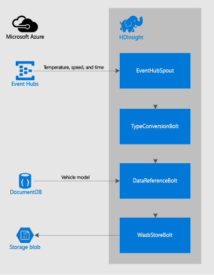

<properties
 pageTitle="Process vehicle sensor data with Apache Storm on HDInsight | Microsoft Azure"
 description="Learn how to process vehicle sensor data from Event Hubs using Apache Storm on HDInsight. Add model data from DocumentDB, and store output to storage."
 services="hdinsight,documentdb,notification-hubs"
 documentationCenter=""
 authors="Blackmist"
 manager="paulettm"
 editor="cgronlun"/>

<tags
ms.service="hdinsight"
ms.devlang="java"
ms.topic="article"
ms.tgt_pltfrm="na"
ms.workload="big-data"
ms.date="11/06/2015"
ms.author="larryfr"/>

#Process vehicle sensor data from Azure Event Hubs using Apache Storm on HDInsight

Learn how to process vehicle sensor data from Azure Event Hubs using Apache Storm on HDInsight. This example reads sensor data from Azure Event Hubs, enriches the data by referencing data stored in Azure DocumentDB, and finally store the data into Azure Storage using the Hadoop File System (HDFS).

##Overview

Adding sensors to vehicles allows you to predict equipment problems based on historical data trends, as well as make improvements to future versions based on usage pattern analysis. While traditional MapReduce batch processing can be used for this analysis, you must be able to quickly and efficiently load the data from all vehicles into Hadoop before MapReduce processing can occur. Additionally, you may wish to do analysis for critical failure paths (engine temperature, brakes, etc.) in real time.

Azure Event Hubs are built to handle the massive volume of data generated by sensors, and Apache Storm on HDInsight can be used to load and process the data before storing it into HDFS (backed by Azure Storage) for additional MapReduce processing.

##Solution

Telemetry data for engine temperature, ambient temperature, and vehicle speed is recorded by sensors, then sent to Event Hubs along with the car's Vehicle Identification Number (VIN) and a time stamp. From there, a Storm Topology running on an Apache Storm on HDInsight cluster reads the data, processes it, and stores it into HDFS.

During processing, the VIN is used to retrieve model information from Azure DocumentDB. This is added to the data stream before it is stored.

The components used in the Storm Topology are:

* **EventHubSpout** - reads data from Azure Event Hubs

* **TypeConversionBolt** - converts the JSON string from Event Hubs into a tuple containing the individual data values for engine temperature, ambient temperature, speed, VIN, and timestamp

* **DataReferencBolt** - looks up the vehicle model from DocumentDB using the VIN

* **WasbStoreBolt** - stores the data to HDFS (Azure Storage)

The following is a diagram of this solution:

> [AZURE.NOTE] This is a simplified diagram, and each component in the solution may have multiple instances. For example, the multiple instances of each component in the topology are distributed across the nodes in the Storm on HDInsight cluster.

##Implementation

A complete, automated solution for this scenario is available as part of the <a href="https://github.com/hdinsight/hdinsight-storm-examples" target="_blank">HDInsight-Storm-Examples</a> repository on GitHub. To use this example, follow the steps in the [IoTExample README.MD](https://github.com/hdinsight/hdinsight-storm-examples/blob/master/IotExample/README.md).

## Next Steps

For more example Storm topologies, see [Example topologies for Storm on HDInsight](hdinsight-storm-example-topology.md).
