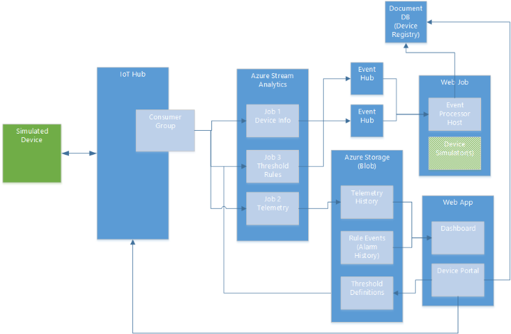
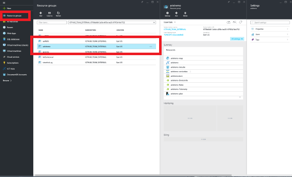
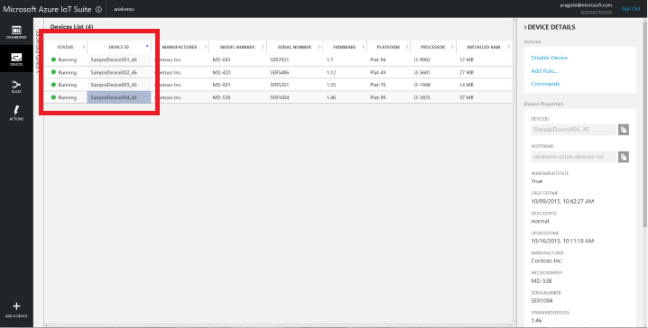
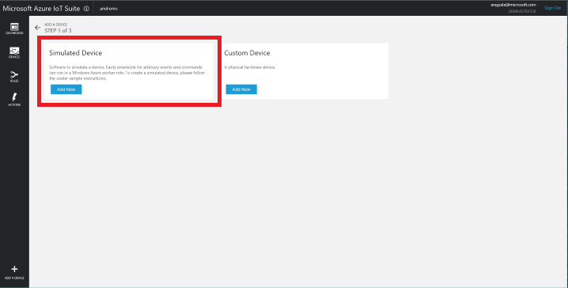
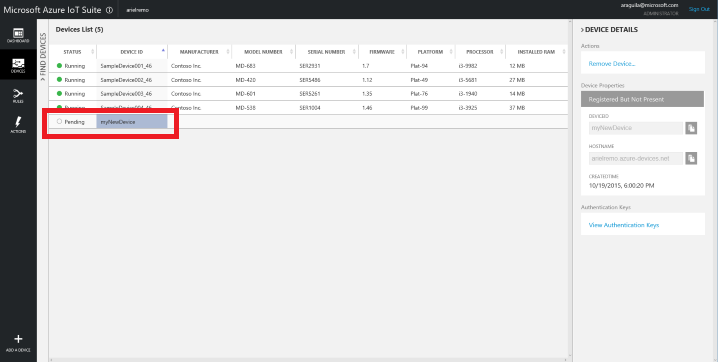
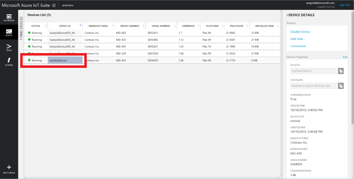
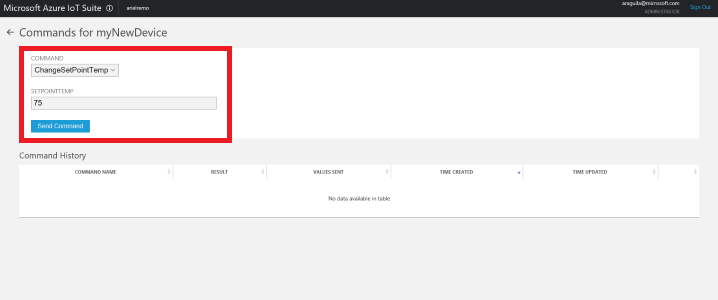
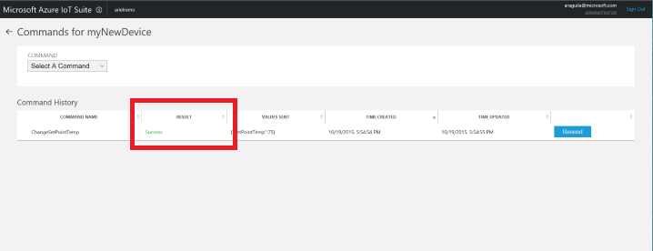
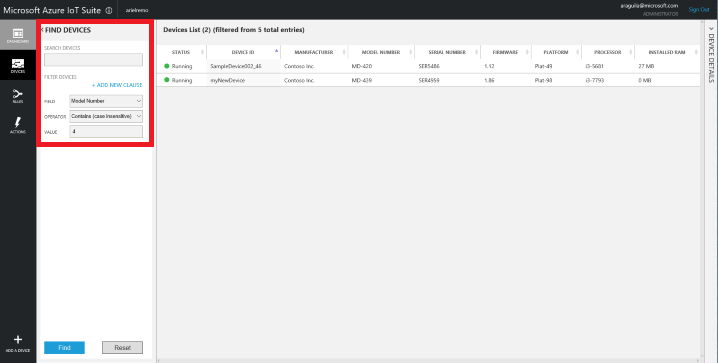
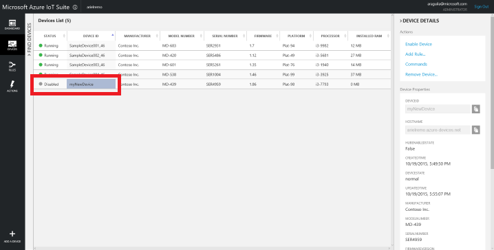

<properties
 pageTitle="Remote Monitoring preconfigured solution walkthrough | Microsoft Azure"
 description="A description of the Azure IoT preconfigured solution remote monitoring and its architecture."
 services=""
 documentationCenter=""
 authors="stevehob"
 manager="timlt"
 editor=""/>

<tags
 ms.service="na"
 ms.devlang="na"
 ms.topic="article"
 ms.tgt_pltfrm="na"
 ms.workload="na"
 ms.date="10/21/2015"
 ms.author="stevehob"/>

# Remote monitoring preconfigured solution walkthrough

## Introduction

The IoT Suite remote monitoring preconfigured solution is a base end-to-end monitoring solution for a business scenario that operates multiple machines in remote locations. The solution combines key Azure IoT Suite services to provide a generic implementation of the business scenario and is a starting point for customers who plan to implement this type of IoT solution to meet their own specific business requirements.

## Logical architecture

The following diagram outlines the logical components of the preconfigured solution:

### Simulated devices

In the preconfigured solution, the simulated device represents a cooling device (such as a building air conditioner or facility air handling unit). Each simulated device sends the following telemetry messages to IoT Hub:

| Message  | Description |
|----------|-------------|
| Startup  | When the device starts, it sends a **device-info** message containing information about itself such as its device id, device metadata, a list of commands the device supports, and the current configuration of the device. |

The simulated devices send the following device properties as metadata:

| Property               |  Purpose |
|------------------------|--------- |
| Device ID              | Id that is either provided or assigned when a device is created in the solution. |
| Manufacturer           | Device manufacturer |
| Model Number           | Model number of the device |
| Serial Number          | Serial number of the device |
| Firmware               | Current version of firmware on the device |
| Platform               | Platform architecture of the device |
| Processor              | Processor running the device |
| Installed RAM          | Amount of RAM installed on the device |
| Hub Enabled State      | IoT Hub state property of the device |
| Created Time           | Time the device was created in the solution |
| Updated Time           | Last time properties were updated for the device |
| Latitude               | Latitude location of the device |
| Longitude              | Longitude location of the device |

The simulator seeds these properties in simulated devices with sample values.  Each time the simulator initializes a simulated device, the device posts the pre-defined metadata to IoT Hub. Note that this overwrites and any metadata updates made in the device portal.

The simulated devices can handle the following commands sent from an IoT hub:

| Command                | Description                                         |
|------------------------|-----------------------------------------------------|
| PingDevice             | Sends a _ping_ to the device to check it is alive   |
| StartTelemetry         | Starts the device sending telemetry 				   |
| StopTelemetry          | Stops the device from sending telemetry             |
| ChangeSetPointTemp     | Changes the set point value around which the random data is generated |
| DiagnosticTelemetry    | Triggers the device simulator to send an additional telemetry value (externalTemp) |
| ChangeDeviceState      | Changes an extended state property for the device and sends the device info message from  the device |

The device command acknowledgment is provided through the IoT hub.

### Azure Stream Analytics jobs

**Job 1: Telemetry** operates on the incoming device telemetry stream using two commands. The first command sends all telemetry messages from the devices to persistent blob storage. The second command computes average, minimum, and maximum humidity values over a five minute sliding window. This data is also sent to blob storage.

**Job 2: Device Info** filters device information messages from the incoming message stream and sends them to an Event Hub endpoint. A device sends device information messages at start up and in response to a **SendDeviceInfo** command.

**Job 3: Rules** evaluates incoming temperature and humidity telemetry values against per-device thresholds. Threshold values are set in the rules editor included in the solution. Each device/value pair is stored by timestamp in a blob which is read into Stream Analytics as **Reference Data**. The job compares any non-empty value against the set threshold for the device. If it exceeds the '>' condition, the job will output an **alarm** event that indicates that the threshold was exceeded and provides the device, value, and timestamp values.

### Event Processor

The **Event Processor** handles device information messages and command responses. It uses:

- Device information messages to update the device registry (stored in the DocumentDB database) with the current device information.
- Command response messages to update the device command history (stored in the DocumentDB database).

## Let's start walking

This section walks you through the components of the solution, describes the intended use case, and provides examples.

### Remote Monitoring Dashboard
This page in the web application uses PowerBI javascript controls (See [PowerBI-visuals repo](https://www.github.com/Microsoft/PowerBI-visuals)) to visualize the output data from the Stream Analytics jobs in blob storage.

### Device Administration Portal

This web app enables you to:

- Provision a new device which sets the unique device id and generates the authentication key.
- Manage device properties which includes viewing existing properties and updating with new properties.
- Send commands to a device.
- View the command history for a device.

### Observing the behavior of the cloud solution
You can view your provisioned resources by going to [Azure preview portal](https://portal.azure.com) and navigating to the resource group with the solution name you specified.

When you first run the sample, there are four preconfigured, simulated devices:

You can use the Device Administration portal to add a new simulated device:

Initially, the status of the new device in the Device Administration portal is **Pending**:

When the app has finished deploying the simulated device, you will see the status of the device change to **Running** in the Device Administration portal as shown in the following screenshot. The **DeviceInfo** Stream Analytics job sends device status information from the device to the Device Administration portal.

Using the solution portal you can send commands such as **ChangeSetPointTemp** to the device:

When the device reports that it has executed the command successfully, the status changes to **Success**:

Using the solution portal you can search for devices with specific characteristics such as a model number:

You can disable a device, and after it is disabled you can remove it:

