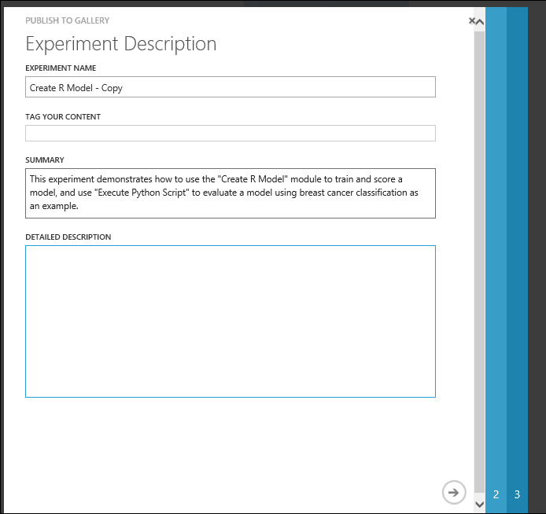
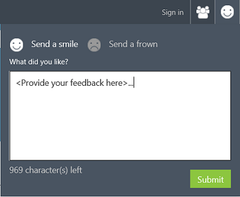

<properties
	pageTitle="Cortana Analytics Gallery | Microsoft Azure"
	description="Share and discover analytics solutions and more in the Cortana Analytics Gallery. Learn from others and make your own contributions to the community."
	services="machine-learning"
	documentationCenter=""
	authors="garyericson"
	manager="paulettm"
	editor="cgronlun"/>

<tags
	ms.service="machine-learning"
	ms.workload="data-services"
	ms.tgt_pltfrm="na"
	ms.devlang="na"
	ms.topic="article"
	ms.date="10/01/2015"
	ms.author="chhavib;cgronlun;garye"/>

# Share and discover solutions in the Cortana Analytics Gallery

The Cortana Analytics Gallery is a community driven site for discovering and sharing solutions built with the Cortana Analytics Suite set of products. It is a destination for users looking to learn from others, to get started developing their own solutions, or to contribute their own work to the advanced analytics community.

**[TAKE ME TO THE GALLERY >>](http://gallery.cortanaanalytics.com)**

[AZURE.INCLUDE [machine-learning-free-trial](../../includes/machine-learning-free-trial.md)]

## Benefits
Start using the Gallery to enjoy these benefits:

- Discover interesting solutions
- Learn from others

Sign in using your Microsoft account to enjoy additional benefits, such as:

- Download experiments to your Machine Learning Studio workspace
- Contribute and showcase your predictive analytic experiments and collections

## Discover and learn
Search and browse the different types of solutions that have been contributed by Microsoft and the advanced analytics community. Use these to get a head start on solving your own data analysis problems.

You can easily find recently published and popular solutions in the Gallery, or you can search by name, tags, algorithms, and other attributes.
View contributions from a particular author by clicking the author name from within any of the tiles.

You can comment, provide feedback, or ask questions through the comments section on each solution page.
You can even share a solution of interest with friends or colleagues using the share capabilities of LinkedIn or Twitter.
You may also email links to these solutions to invite other users to view the pages.

## Download experiments
The Cortana Analytics Gallery allows you to easily copy predictive analytics experiments to your Machine Learning Studio workspace with a single click and immediately start using it for your purpose.
If you're not already signed in while browsing, you will be prompted to sign in using your Microsoft account before the experiment is copied to your workspace.

## Contribute
When you sign-in you become a member of the Gallery community, which allows you to contribute your own experiments and collections so that others can benefit from the solutions you've discovered.

### Contribute experiments

An *experiment* is a canvas in Machine Learning Studio that lets you construct a predictive analysis model by connecting together data with various analytical modules. You can try different ideas, do trial runs, and eventually publish your model as a web service in Azure. For an example of creating a simple experiment, see [Machine learning tutorial: Create your first experiment in Azure Machine Learning Studio](machine-learning-create-experiment.md). For a more complete walkthrough of creating a predictive analytics solution, see [Walkthrough: Develop a predictive analytics solution for credit risk assessment in Azure Machine Learning](machine-learning-walkthrough-develop-predictive-solution.md).

Follow these steps to contribute an experiment to the Cortana Analytics Gallery:

- Sign in to the Machine Learning Studio using your Microsoft account
- Create your experiment and run it
- When you’re ready to publish your experiment to the Gallery, click **Publish to Gallery** below the experiment canvas

### Contribute collections

A *collection* is a list of related items from Cortana Analytics Gallery that are grouped together for later reference, use, or sharing.
Your collection can contain items that you own or items that have been contributed by the community.

For example, you can use a collection to group together items on a specific topic, or you can group together a multi-step experiment that solves a complex problem.
The initial collections contributed by Microsoft consist of multi-step machine learning experiment templates for solving real world problems, such as online fraud detection, text classification, retail forecasting, and predictive maintenance.

Follow these steps to create and contribute a collection to the Cortana Analytics Gallery:

- Sign in to the Gallery using your Microsoft account
- Click your image at the top of the window and click your name
- Click **New Collection**
- Give the collection a name, a brief summary, a description, and any tags that will help users find the collection
- Add an image to identify the collection
- Click **Create**

Your collection is now part of the Cortana Analytics Gallery.

You can add items to your collection by opening the collection, clicking **Edit**, and then clicking **Add Item**. Or, if you find an item while browsing through the Gallery that you want to include, just open the item, click **Add to collection**, and specify the collection you want to add it to.

You can change the summary, description, or tags of your collection by opening the collection and clicking **Edit**.
While you're editing your collection, you can also change the order of the items in the collection by using the arrow buttons next to an item to move it in the list. And you add notes to the items in your collection by clicking the upper-right corner of an item and selecting **Add/Edit note**.

<!--

-->

## We want to hear from you!
We want the Gallery to be driven by our users and for our users. Use the smiley on the right to tell us what you love or hate about the Gallery.  

## Frequently Asked Questions
**I would like to make changes to the workflow of the experiment I submitted to the Gallery. How can I do that?**

As of right now we do not support workflow updates to experiments you have already published to the Gallery. You may publish any such changes as a new experiment into the Gallery and delete your old one. We are actively working on enabling publishing updates to workflow for experiments already contributed to the Gallery.

**Will I need to publish a new experiment even if I have to edit only the tags or description?**

The following type of edits can be made to an experiment you have already contributed without having to publish it again:

- Experiment Name
- Summary Text
- Description Text
- Tags
- Images

In order to edit these fields, click the specific experiment you would like to edit (make sure you're signed in with your Microsoft account). This will open the experiment details page where you can see options to edit or delete. Clicking **Edit** allows you to edit any of the above fields.

**I just published my experiment to the Gallery. I don’t see my profile picture showing up with my name.**

It's possible that you're using an account other than @outlook, @msn, @live or @hotmail. If that's the case, you'll see a placeholder image instead of the profile picture from your Microsoft account configuration settings. Using a Microsoft account and re-submitting the experiment should help solve this issue.

**I updated my profile picture in my Microsoft account configuration settings. Why are my existing experiment contributions not reflecting this new profile picture?**

If you want to reflect the most recent profile change (profile picture, first name, or last name) for all your experiments, you should re-submit the older experiments to the Gallery. In doing so you'll need to delete the older copies that reflect the old profile settings.

**What are the image requirements when submitting or editing an image for my experiment?**

The images you submit along with your experiment will be used to create an experiment tile for your contribution. It's recommended that the images be < 500Kb in size, with an aspect ratio of 3:2. A resolution of 960x640 is recommended

**What happens to the dataset I have used in the experiment? Does the data set get published to the Gallery as well?**

If your dataset is part of your experiment and not being imported through a reader module, it's part of your experiment and gets published to the Gallery with your experiment. For this reason ensure that the dataset you're publishing with the experiment has the appropriate licensing terms that allow sharing and downloading by anyone.

**I have an experiment that uses a Reader module to pull data from HDInsight or SQL. It uses my credentials to retrieve the data. How can I publish such an experiment and be assured that my credentials will not be shared?**

At this time we do not allow publishing of experiments that use credentials.

**How do I de-limit tags?**

You can use tab to de-limit tags.

**I see some experiments have rich descriptions with rich rendering capabilities. However when I try to provide a description, the description is presented in plain text.**

Rich description rendering is not available to all Gallery users widely. We're actively working on making this capability available by supporting markdown rendering.

**[TAKE ME TO THE GALLERY >>](http://gallery.cortanaanalytics.com)**
