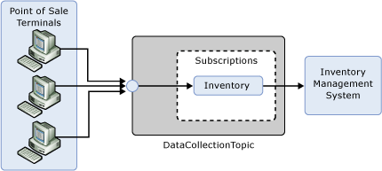
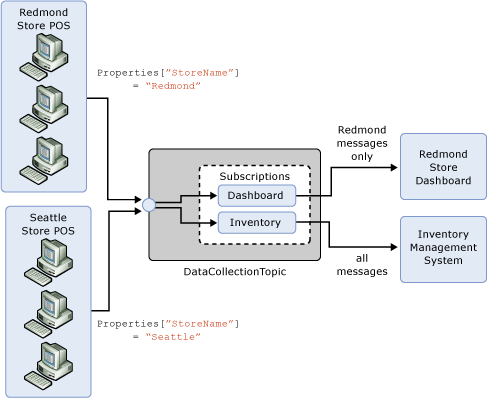

<properties 
   pageTitle="Create applications that use Service Bus topics and subscriptions | Microsoft Azure"
   description="Introduction to the publish-subscribe capabilities offered by Service Bus topics and subscriptions."
   services="service-bus"
   documentationCenter="na"
   authors="sethmanheim"
   manager="timlt"
   editor="tysonn" />
<tags 
   ms.service="service-bus"
   ms.devlang="na"
   ms.topic="article"
   ms.tgt_pltfrm="na"
   ms.workload="na"
   ms.date="09/16/2015"
   ms.author="sethm" />

# Create applications that use Service Bus topics and subscriptions

Azure Service Bus supports a set of cloud-based, message-oriented middleware technologies including reliable message queuing and durable publish/subscribe messaging. This article builds on the information provided in [Create applications that use Service Bus queues](service-bus-create-queues.md) and offers an introduction to the publish/subscribe capabilities offered by Service Bus topics.

## Evolving retail scenario

This article continues the retail scenario used in [Create applications that use Service Bus queues](service-bus-create-queues.md). Recall that sales data from individual Point of Sale (POS) terminals must be routed to an inventory management system which uses that data to determine when stock has to be replenished. Each POS terminal reports its sales data by sending messages to the **DataCollectionQueue** queue, where they remain until they are received by the inventory management system, as shown here:


To evolve this scenario, a new requirement has been added to the system: the store owner wants to be able to monitor how the store is performing in real time.

To address this requirement, the system must "tap" off the sales data stream. We still want each message sent by the POS terminals to be sent to the inventory management system as before, but we want another copy of each message that we can use to present the dashboard view to the store owner.

In any situation such as this, in which you require each message to be consumed by multiple parties, you can use Service Bus *topics*. Topics provide a publish/subscribe pattern in which each published message is made available to one or more subscriptions registered with the topic. In contrast, with queues each message is received by a single consumer.

Messages are sent to a topic in the same way as they are sent to a queue. However, messages are not received from the topic directly; they are received from subscriptions. You can think of a subscription to a topic as a virtual queue that receives copies of the messages that are sent to that topic. Messages are received from a subscription the same way as they are received from a queue.

Going back to the retail scenario, the queue is replaced by a topic, and a subscription is added that will be used by the inventory management system component. The system now appears as follows:



The configuration here performs identically to the previous queue-based design. That is, messages sent to the topic are routed to the **Inventory** subscription, from which the **Inventory Management System** consumes them.

In order to support the management dashboard, we create a second subscription on the topic, as shown here:


With this configuration, each message from the POS terminals is made available to both the **Dashboard** and **Inventory** subscriptions.

## Show me the code

[Create applications that use Service Bus queues](service-bus-create-queues.md) describes how to sign-up for a Service Bus account and create a service namespace. To use a Service Bus namespace, an application must reference the Service Bus assembly, specifically Microsoft.ServiceBus.dll. The easiest way to reference Service Bus dependencies is to install the Service Bus [Nuget package](https://www.nuget.org/packages/WindowsAzure.ServiceBus/). You can also find the assembly as part of the Azure SDK. The download is available at the [Azure SDK download page](http://azure.microsoft.com/downloads/).

### Create the topic and subscriptions

Management operations for Service Bus messaging entities (queues and publish/subscribe topics) are performed via the [NamespaceManager](https://msdn.microsoft.com/library/azure/microsoft.servicebus.namespacemanager.aspx) class. Appropriate credentials are required in order to create a [NamespaceManager](https://msdn.microsoft.com/library/azure/microsoft.servicebus.namespacemanager.aspx) instance for a particular namespace. Service Bus uses a [Shared Access Signature (SAS)](service-bus-sas-overview.md) based security model. The [TokenProvider](https://msdn.microsoft.com/library/azure/microsoft.servicebus.tokenprovider.aspx) class represents a security token provider with built-in factory methods returning some well-known token providers. We’ll use a [CreateSharedAccessSignatureTokenProvider](https://msdn.microsoft.com/library/azure/microsoft.servicebus.tokenprovider.createsharedaccesssignaturetokenprovider.aspx) method to hold the SAS credentials. The [NamespaceManager](https://msdn.microsoft.com/library/azure/microsoft.servicebus.namespacemanager.aspx) instance is then constructed with the base address of the Service Bus namespace and the token provider.

The [NamespaceManager](https://msdn.microsoft.com/library/azure/microsoft.servicebus.namespacemanager.aspx) class provides methods to create, enumerate and delete messaging entities. The code that is shown here shows how the [NamespaceManager](https://msdn.microsoft.com/library/azure/microsoft.servicebus.namespacemanager.aspx) instance is created and used to create the **DataCollectionTopic** topic.

```
Uri uri = ServiceBusEnvironment.CreateServiceUri("sb", "test-blog", string.Empty);
string name = "RootManageSharedAccessKey";
string key = "abcdefghijklmopqrstuvwxyz";
     
TokenProvider tokenProvider = TokenProvider.CreateSharedAccessSignatureTokenProvider(name, key);
NamespaceManager namespaceManager = new NamespaceManager(uri, tokenProvider);
 
namespaceManager.CreateTopic("DataCollectionTopic");
```

Note that there are overloads of the [CreateTopic](https://msdn.microsoft.com/library/azure/hh293080.aspx) method that enable you to set properties of the topic. For example, you can set the default time-to-live (TTL) value for messages sent to the topic. Next, add the **Inventory** and **Dashboard** subscriptions.

```
namespaceManager.CreateSubscription("DataCollectionTopic", "Inventory");
namespaceManager.CreateSubscription("DataCollectionTopic", "Dashboard");
```

### Send messages to the topic

For run-time operations on Service Bus entities; for example, sending and receiving messages, an application must first create a [MessagingFactory](https://msdn.microsoft.com/library/azure/microsoft.servicebus.messaging.messagingfactory.aspx) object. Similar to the [NamespaceManager](https://msdn.microsoft.com/library/azure/microsoft.servicebus.namespacemanager.aspx) class, the [MessagingFactory](https://msdn.microsoft.com/library/azure/microsoft.servicebus.messaging.messagingfactory.aspx) instance is created from the base address of the service namespace and the token provider.

```
MessagingFactory factory = MessagingFactory.Create(uri, tokenProvider);
```

Messages sent to and received from Service Bus topics, are instances of the [BrokeredMessage](https://msdn.microsoft.com/library/azure/microsoft.servicebus.messaging.brokeredmessage.aspx) class. This class consists of a set of standard properties (such as [Label](https://msdn.microsoft.com/library/azure/microsoft.servicebus.messaging.brokeredmessage.label.aspx) and [TimeToLive](https://msdn.microsoft.com/library/azure/microsoft.servicebus.messaging.brokeredmessage.timetolive.aspx)), a dictionary that is used to hold application properties, and a body of arbitrary application data. An application can set the body by passing in any serializable object (the following example passes in a **SalesData** object that represents the sales data from the POS terminal), which will use the [DataContractSerializer](https://msdn.microsoft.com/library/azure/system.runtime.serialization.datacontractserializer.aspx) to serialize the object. Alternatively, a [Stream](https://msdn.microsoft.com/library/azure/system.io.stream.aspx) object can be provided.

```
BrokeredMessage bm = new BrokeredMessage(salesData);
bm.Label = "SalesReport";
bm.Properties["StoreName"] = "Redmond";
bm.Properties["MachineID"] = "POS_1";
```

The easiest way to send messages to the topic is to use [CreateMessageSender](https://msdn.microsoft.com/library/azure/hh322659.aspx) to create a [MessageSender](https://msdn.microsoft.com/library/azure/microsoft.servicebus.messaging.messagesender.aspx) object directly from the [MessagingFactory](https://msdn.microsoft.com/library/azure/microsoft.servicebus.messaging.messagingfactory.aspx) instance.

```
MessageSender sender = factory.CreateMessageSender("DataCollectionQueue");
sender.Send(bm);
```

### Receive messages from a subscription

Similar to using queues, to receive messages from a subscription you can use a [MessageReceiver](https://msdn.microsoft.com/library/azure/microsoft.servicebus.messaging.messagereceiver.aspx) object which you create directly from the [MessagingFactory](https://msdn.microsoft.com/library/azure/microsoft.servicebus.messaging.messagingfactory.aspx) using [CreateMessageReceiver](https://msdn.microsoft.com/library/azure/hh322642.aspx). You can use one of the two different receive modes (**ReceiveAndDelete** and **PeekLock**), as discussed in [Create applications that use Service Bus queues](service-bus-create-queues.md).

Note that when you create a [MessageReceiver](https://msdn.microsoft.com/library/azure/microsoft.servicebus.messaging.messagereceiver.aspx) for subscriptions, the *entityPath* parameter is of the form `topicPath/subscriptions/subscriptionName`. Therefore, to create a [MessageReceiver](https://msdn.microsoft.com/library/azure/microsoft.servicebus.messaging.messagereceiver.aspx) for the **Inventory** subscription of the **DataCollectionTopic** topic, *entityPath* must be set to `DataCollectionTopic/subscriptions/Inventory`. The code appears as follows:

```
MessageReceiver receiver = factory.CreateMessageReceiver("DataCollectionTopic/subscriptions/Inventory");
BrokeredMessage receivedMessage = receiver.Receive();
try
{
    ProcessMessage(receivedMessage);
    receivedMessage.Complete();
}
catch (Exception e)
{
    receivedMessage.Abandon();
}
```

## Subscription filters

So far, in this article all messages sent to the topic are made available to all registered subscriptions. The key phrase here is "made available." While Service Bus subscriptions see all messages sent to the topic, you can copy only a subset of those messages to the virtual subscription queue. This is performed using subscription *filters*. When you create a subscription, you can supply a filter expression in the form of a SQL92 style predicate that operates over the properties of the message, both the system properties (for example, [Label](https://msdn.microsoft.com/library/azure/microsoft.servicebus.messaging.brokeredmessage.label.aspx)) and the application properties, such as **StoreName** in the previous example.

Evolving the scenario to illustrate this, a second store is to be added to our retail scenario. Sales data from all of the POS terminals from both stores still have to be routed to the centralized inventory management system, but a store manager using the dashboard tool is only interested in the performance of that store. You can use subscription filtering to achieve this. Note that when the POS terminals publish messages, they set the **StoreName** application property on the message. Given two stores, for example **Redmond** and **Seattle**, the POS terminals in the Redmond store stamp their sales data messages with a **StoreName** equal to **Redmond**, whereas the Seattle store POS terminals use a **StoreName** equal to **Seattle**. The store manager of the Redmond store only wants to see data from its POS terminals. The system appears as follows:



To set up this routing, you create the **Dashboard** subscription as follows:

```
SqlFilter dashboardFilter = new SqlFilter("StoreName = 'Redmond'");
namespaceManager.CreateSubscription("DataCollectionTopic", "Dashboard", dashboardFilter);
```

With this subscription filter, only messages that have the **StoreName** property set to **Redmond** will be copied to the virtual queue for the **Dashboard** subscription. There is much more to subscription filtering, however. Applications can have multiple filter rules per subscription in addition to the ability to modify the properties of a message as it passes to a subscription's virtual queue.

## Summary

All of the reasons to use queuing described in [Create applications that use Service Bus queues](service-bus-create-queues.md) also apply to topics, specifically:

- Temporal decoupling – message producers and consumers do not have to be online at the same time.

- Load leveling – peaks in load are smoothed out by the topic enabling consuming applications to be provisioned for average load instead of peak load.

- Load balancing – similar to a queue, you can have multiple competing consumers listening on a single subscription, with each message handed off to only one of the consumers, thereby balancing load.

- Loose coupling – you can evolve the messaging network without affecting existing endpoints; for example, adding subscriptions or changing filters to a topic to allow for new consumers.

## Next steps

See [Create applications that use Service Bus topics and subscriptions](service-bus-create-topics-subscriptions.md) to see how to use queues in the POS retail scenario.