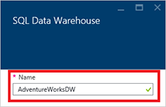
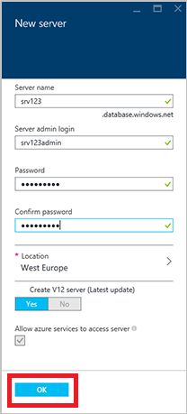
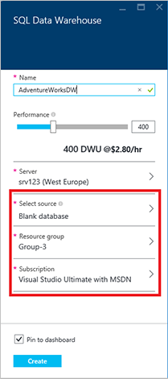
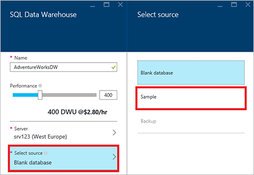
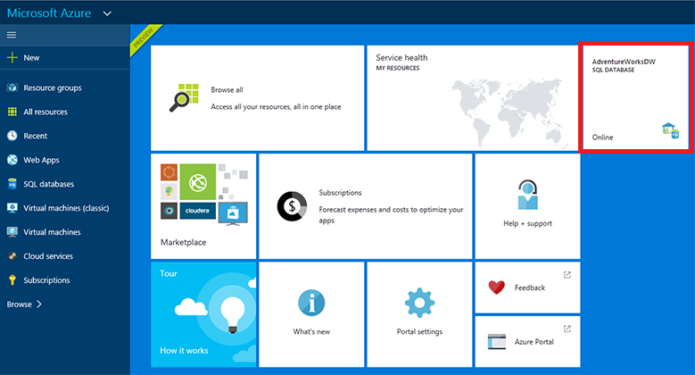
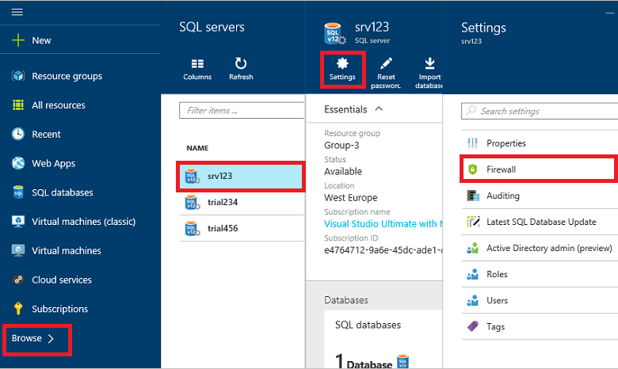
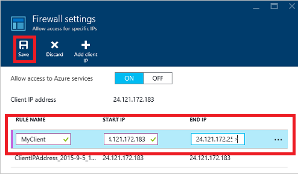

<properties
	pageTitle="Create a SQL Data Warehouse database in the Azure preview portal | Microsoft Azure"
	description="Learn how to create an Azure SQL Data Warehouse in the Azure preview portal"
	services="sql-data-warehouse"
	documentationCenter="NA"
	authors="barbkess"
	manager="jhubbard"
	editor=""
	tags="azure-sql-data-warehouse"/>
<tags
   ms.service="sql-data-warehouse"
   ms.devlang="NA"
   ms.topic="get-started-article"
   ms.tgt_pltfrm="NA"
   ms.workload="data-services"
   ms.date="11/19/2015"
   ms.author="lodipalm;barbkess"/>

# Create a SQL Data Warehouse

> [AZURE.SELECTOR]
- [Azure preview portal](sql-data-warehouse-get-started-provision.md)
- [TSQL](sql-data-warehouse-get-started-create-database-tsql.md)
- [PowerShell](sql-data-warehouse-get-started-provision-powershell.md)

This tutorial shows you how to create an Azure SQL Data Warehouse database in just a few minutes by using the Azure preview portal. 

In this tutorial you will:

- Create a server that will host your database.
- Create a database that contains AdventureWorksDW sample database.

[AZURE.INCLUDE [free-trial-note](../../includes/free-trial-note.md)]

## Step 1: Sign in and get started

1. Sign in to the [Azure preview portal](https://portal.azure.com).

2. Click **New** > **Data + Storage** > **SQL Data Warehouse**.

    

1. Enter a name for your database in the SQL Data Warehouse blade. In this example, we name the database AdventureWorksDW.

    

## Step 2: Configure and create a server

In SQL Database and SQL Data Warehouse, each database is assigned to a server, and each server is assigned to a geographical location. The server is called a logical SQL server.

> [AZURE.NOTE] A logical SQL server:
  >
  > + Provides a consistent way to configure multiple databases within the same geographical location.
  > + Is not physical hardware like it is for an on-premises server. It  is part of the service software. This is why we call it a *logical server*.
  > + Can host multiple databases without impacting their performance.
  > + Uses a lower case *s* in its name. SQL **s**erver is an Azure logical server, whereas SQL **S**erver is Microsoft's on-premises database product.

1. Click **Server** > **Create a new server**. There is no charge for the server. If you already have a V12 logical SQL server that you want to use, choose your existing server and go to the next step. 

    

3. Fill in the **New server** information. 
    
	- **Server Name**. Enter a name for your logical server. This is unique for each geographical location.
	- **Server Admin Name**. Enter a user name for the server administrator account.
	- **Password**. Enter the server admin password. 
	- **Location**. Choose a geographical location for your server. To reduce data transfer time, it's best to locate your server geographically close to other data resources this database will access.
	- **Create V12 Server**. YES is the only option for SQL Data Warehouse. 
	- **Allow azure services to access server**. This is always checked for SQL Data Warehouse

    >[AZURE.NOTE] Be sure to store the server name, server admin name, and password somewhere.  You will need this information to log on to the server.

1. Click **OK** to save the logical SQL server configuration settings and return to the SQL Data Warehouse blade.

    

## Step 3: Configure and create a database

Now that you have selected your logical SQL server, you are ready to finish creating the database.
 
2. In the **SQL Data Warehouse** blade, fill in the remaining fields. 

    
    
    - **Performance**: We recommend starting with 400 DWUs. You can move the slider to the left or right to adjust the performance level for your database, both now and after the database is created. 

        > [AZURE.NOTE] SQL Data Warehouse measures performance in Data Warehouse Units (DWUs). As you increase DWUs, SQL Data Warehouse increases the computing resources available for your database operations. As you run your workload, you will be able to see how DWUs relate to your workload performance. 
        > 
        > You can quickly and easily change the performance level after the database is created.  For example, if you are not using the database, move the slider to the left to reduce costs. Or, increase performance when more resources are needed. To incur 0 costs, you can pause the database. This is the scalable power of SQL Data Warehouse.

    - **Select source**. Click **Select source** > **Sample**. Since there is only one sample database available at this time, when you select Sample Azure automatically populates the **Select sample** option with AdventureWorksDW. 
  
        

    - **Resource group**. You can keep the default values. Resource groups are containers designed to help you manage a collection of Azure resources. Learn more about [resource groups](../azure-portal/resource-group-portal.md).
    
    - **Subscription**. Select the subscription to bill for this database.

1. Click **Create** to create your SQL Data Warehouse database. 

1. Wait for a few minutes and your database will be ready. When finished, you should be returned to the [Azure preview portal](https://portal.azure.com). Notice that your SQL Data Warehouse database has been added to the dashboard.

    

## Step 4: Configure server firewall access for your client IP

To connect to the server from your current IP address, add your client IP address to the firewall rules. This step shows you how to do that.

1. Click **Browse** > **SQL Servers** > Choose your server > **Settings** > **Firewall**.

    

4. Click **Add Client IP** to have Azure create a rule for your Client IP address. Click **Save**.

	

1. Create a firewall rule with a range of IP addresses. You can do this now or later.

	>[AZURE.IMPORTANT] You're IP address is likely to change from time to time, and you may not be able to access your server until you create a new firewall rule. To ensure consistent access, we recommend adding a range of IP addresses. For further details, see [How to configure firewall settings](../sql-database/sql-database-configure-firewall-settings.md).

    To create a rule, enter a name and the IP address range, and click **Save**. 

    

Now that you have configured the firewall you will be able to make connections from your desktop to the Azure SQL Data Warehouse database you just created.

## Next steps

Now that you have created a sample database for SQL Data Warehouse, you are ready to [Connect](./sql-data-warehouse-get-started-connect.md) to your database.

