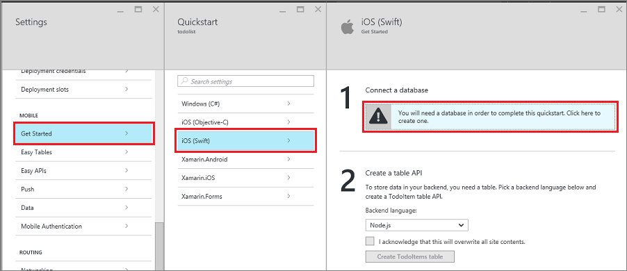

1. Log into the [Azure Portal].

2. In the top left of the window, click the **+NEW** button > **Web + Mobile** > **Mobile App**, then provide a name for your Mobile App backend.

3. In the **Resource Group** box, select an existing resource group. If you have no resource groups, enter the same name as your app. 
 
	At this point, the default App Service plan is selected, which is in the Free tier. The App Service plan settings determine the location, features, cost and compute resources associated with your app. You can either select another App Service plan or create a new one. For more about App Services plans and how to create a new plan, see [Azure App Service plans in-depth overview](../app-service/azure-web-sites-web-hosting-plans-in-depth-overview.md)

4. Use the default App Service plan, select a different plan or [create a new plan](../app-service/azure-web-sites-web-hosting-plans-in-depth-overview.md#create-an-app-service-plan), then click **Create**. 
	
	This creates the Mobile App backend. Later you will deploy your server project to this backend. Provisioning a Mobile App backend can take several minutes; the **Settings** blade for the Mobile App backend is displayed when complete. Before you can use the Mobile App backend, you must also define a connection a data store.

    > [AZURE.NOTE] As part of this tutorial, you create a new SQL Database instance and server. You can reuse this new database and administer it as you would any other SQL Database instance. If you already have a database in the same location as the new mobile app backend, you can instead choose **Use an existing database** and then select that database. The use of a database in a different location is not recommended because of additional bandwidth costs and higher latencies. Other data storage options are available. 

6. In the **Settings** blade for the new Mobile App backend, scroll down to Mobile and click **Get started** > your client app platform > **Connect a database**. 

	

7. In the **Add data connection** blade, click **SQL Database** > **Create a new database**, type the database **Name**, choose a pricing tier, then click **Server**.  
 
    

8. In the **New server** blade, type a unique server name in the **Server name** field, provide a secure **Server admin login** and **Password**, make sure that **Allow azure services to access server** is checked, then click **OK** twice. This creates the new database and server.

10. Back in the **Add data connection** blade, click **Connection string**, type the login and password values for your database, then click **OK** twice.

	Creation of the database can take a few minutes.  Use the **Notifications** area to monitor the progress of the deployment.  You cannot continue until the database has been deployed sucessfully.

<!-- URLs. -->
[Azure Portal]: https://portal.azure.com/
