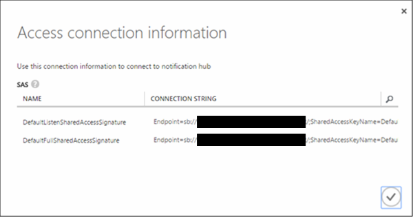

1. Log on to the [Azure Management Portal](https://manage.windowsazure.com/), and then click **+NEW** at the bottom of the screen.

2. Click on **App Services**, then **Service Bus**, then **Notification Hub**, then **Quick Create**.

   	

3. Enter a **Notification Hub Name**. Select your desired **region** and **subscription**. 
 
	If you already have a service bus namespace that you want create the hub in, select your **Namespace Name**.  Otherwise, you can use the default **Namespace Name** which will be created based on the hub name as long as the namespace name is available. 

	Click **Create a new Notification Hub**.

   	

4. Once the namespace and notification hub are created, your namespaces in service bus will be displayed. Click the namespace that you just created your hub in (usually ***notification hub name*-ns**). 

5. On your namespace page, click the **Notification Hubs** tab at the top, and then click on the notification hub you just created. This will open the dashboard for your new notification hub.

6. On the dashboard for your new hub click **View Connection String**. Take note of the two connection strings. You will use these later.

   	

	

